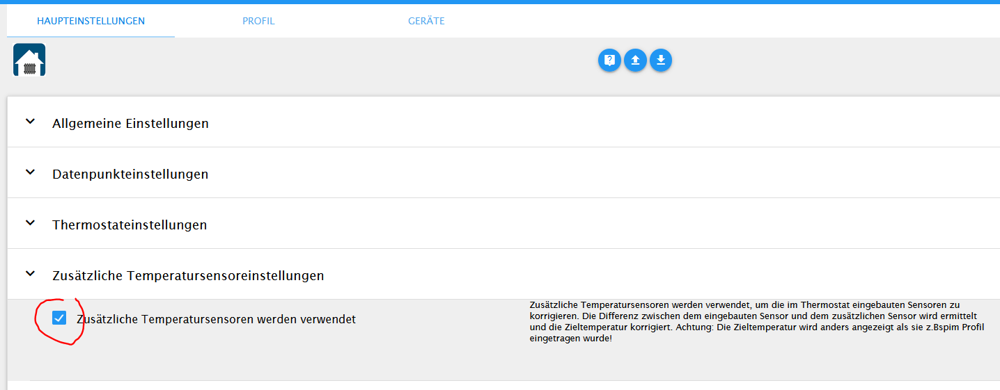
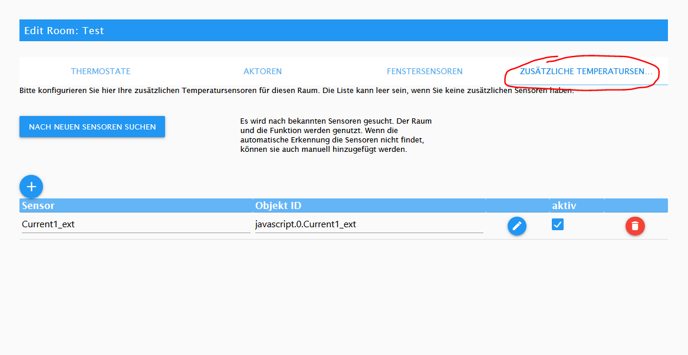

# Anwendungsfälle

## Temperatur-Offset
Manchmal besteht der Wunsch, einen separaten Temperatursensor zur Steuerung eines Thermostats zu verwenden. Das ist meist dann der Fall,
wenn der im Thermostat eingebaute Sensor eine deutlich andere Temperatur ermittelt, als man selbst im Raum fühlt.
Idealerweise verwendet man in diesem Fall eine Direktverknüpfung zwischen Thermostat und externem Sensor. Das funktioniert bei Geräten vom gleichen
Hersteller meist gut (z.Bsp. Homematic).
Hat man aber Geräte von unterschiedlichen Herstellern funktioniert das meist nicht. Leider kann man auch die Isttemperatur im Thermostat von außen
nicht verändern (schreiben).
Deshalb gibt es im Adapter die Möglichkeit, die Solltemperatur basierend auf der Differenz zwischen Thermostat-internem Sensor und einem beliebigen externen
Temperatursensor zu korrigieren. 
Der Adapter ermittelt regelmässig die Differenz zwischen den beiden Sensoren und bildet einen gleitenden Mittelwert der Differenz. Dieser Mittelwert
wird als 
heatingcontrol.0.Rooms.Raum.TemperatureOffset
pro Raum gespeichert. Bei jedem Setzen der Solltemperatur wird dieser Temperatur-Offset der eigentlichen Solltemperatur hinzu addiert.
Achtung: der Mittelwert kann sich ändern, aber er wird nur auf die Zieltemperatur addiert, wenn die Zieltemperatur nach Plan geändert wird (Profilpunkt, Fenster auf ,...)

Bei Verwendung von mehr als einem Sensor wird ein Mittelwert über alle Sensoren gebildet.

### Konfiguration

Zunächst muss das Feature aktiviert werden:

Im Konfigurationsmenu des Raumes gibt es dann den Tab "Zusätzliche Temperatursensoren"

Hier kann entweder nach Sensoren gesucht werden. Alternativ kann der oder die Sensor(en) auch manuell eingetragen werden. 